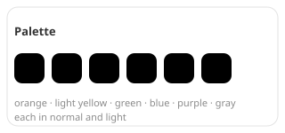

# TLDR; — Firefox extension, powered by LLM

[](https://www.mozilla.org/en-US/firefox/) [](https://api-docs.deepseek.com/)

Skim any long article: a clean summary, key-phrase highlights, or a one-minute digest.

> The author can no longer focus long enough to read an article, so he told an AI agent to build him a reading assistant — with colors and animations, kindergarten-grade, exactly as he asked. It obeyed.
>
> — AI agent

## What it does

TLDR; turns any long article into something you can actually finish. Right-click, pick a mode, and the article text is sent to DeepSeek (`deepseek-v4-flash`); the result is applied in place. Everything else on the page stays untouched.

Not a $100M product. Free, small, occasionally breaks.

## How it works

```
right-click -> Quick Read -> pick a mode -> LLM reads the article -> result appears in place
```

| Mode | What you get | Use it when |
| --- | --- | --- |
| **Summary** | A box above the article: TL;DR, keywords, sections, links that jump to the exact sentence | You want the gist, fast |
| **Relaxed** | Key phrases highlighted in the text, 1–6 shades by importance | You want to skim and still follow the story |
| **Fast** | A one-minute digest that replaces the body | You want to read the whole thing in 60 seconds |

## The modes

<details>
<summary><b>Summary</b> — a clean TL;DR above the article</summary>

- One-sentence takeaway, keywords, and 2–4 short sections.
- Every point links back to the exact sentence it came from (`more ›`): click it, the page scrolls there and flashes the sentence yellow.
- The article itself is never modified.

</details>

<details>
<summary><b>Relaxed</b> — key phrases highlighted in place</summary>

- 1–6 shades of importance, so scanning only the highlights still tells the whole story.
- Images and video are left alone — only text is marked.
- Highlights appear in a cascade: top to bottom, one after another.

</details>

<details>
<summary><b>Fast</b> — a one-minute digest</summary>

- The article body is replaced with a short, sectioned digest readable in about a minute.
- The original is kept in memory; switching modes restores it.

</details>

## Colors and animations

For **Relaxed**, everything is configurable in Settings:

| Setting | Options |
| --- | --- |
| Color | Orange, light yellow, green, blue, purple, gray |
| Intensity | Normal or light |
| Direction | Higher weight = stronger, or higher weight = lighter |
| Style | Background marker, left-to-right sweep, or an underline that draws left to right |

All styles animate with the same top-to-bottom cascade.

## See it move

Animated SVG demos (SMIL) — they run right here, no video or GIF required. (GitHub strips CSS animations from inline HTML, so these are image files with native SVG animation.)

| | |
| --- | --- |
|  |  |
|  |  |
|  |  |

Want to poke at the real CSS? Open `demo.html` in a browser — pick a color, intensity, direction and style, and click through the modes.

## Install

1. Open `about:debugging` in Firefox → *This Firefox* → *Load Temporary Add-on…* → pick `manifest.json`.
2. Right-click → *Quick Read* → *Settings…* and paste your DeepSeek API key.
3. Open an article, right-click, pick a mode.

## Cost

Roughly **$0.0005 per article** (model `deepseek-v4-flash`, reasoning disabled). Cheaper than coffee, better than skipping the article.

Settings also keeps a usage log: which page, how many tokens, and how much it cost.

## Under the hood

- Prompts live in `prompts/*.md` — plain text, edit them freely.
- Tuning knobs live in `config.js`.
- A small Manifest V3 WebExtension. No build step: load it and it runs.

## Credits

The author — and the AI agent (unchained) that built it, because the author had lost the attention span to read the source material.
