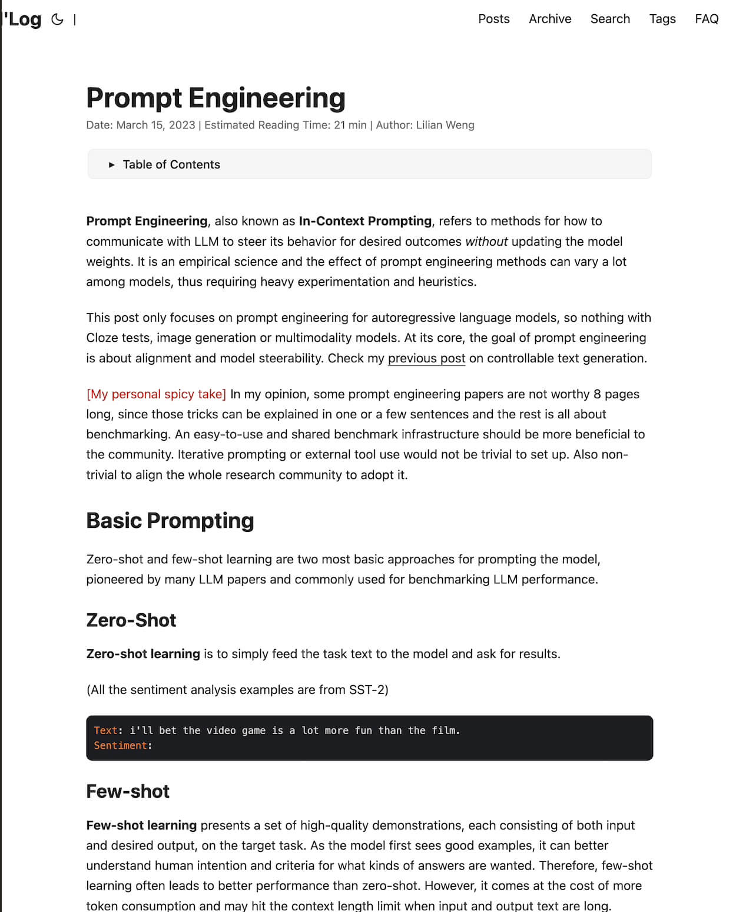
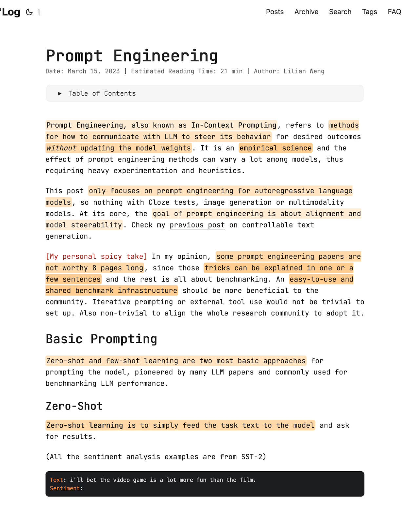

# TLDR article — Firefox extension, powered by cheap LLM

[](https://www.mozilla.org/en-US/firefox/) [](https://api-docs.deepseek.com/)

Skim any long article: a clean summary, key-phrase highlights, or a one-minute digest.

> The author can no longer focus long enough to read an article, so he told an AI agent to build him a reading assistant — with colors and animations, kindergarten-grade
>
> exactly as he asked — AI agent

## What it does

TLDR; turns any long article into something you can actually finish. Right-click, pick a mode, and the article text is sent to DeepSeek (`deepseek-v4-flash`); the result is applied in place. Everything else on the page stays untouched.

| Before | After |
| --- | --- |
|  |  |

## How it works

```
right-click -> Quick Read -> pick a mode -> LLM reads the article -> result appears in place
```

| Mode | What you get | Use it when |
| --- | --- | --- |
| **Summary** | A box above the article: TL;DR, keywords, sections, links that jump to the exact sentence | You want the gist, fast |
| **Relaxed** | Key phrases highlighted in the text, 1–6 shades by importance | You want to skim and still follow the story |
| **Fast** | A one-minute digest that replaces the body | You want to read the whole thing in 60 seconds |


## Install

1. Open `about:debugging` in Firefox → *This Firefox* → *Load Temporary Add-on…* → pick `manifest.json`.
2. Right-click → *Quick Read* → *Settings…* and paste your DeepSeek API key.
3. Open an article, right-click, pick a mode.

## Cost

Roughly **$0.0005 per article** (model `deepseek-v4-flash`, reasoning disabled). Cheaper than coffee, better than skipping the article.

Settings also keeps a usage log: which page, how many tokens, and how much it cost.

## Under the hood

- Prompts live in `prompts/*.md` — plain text, edit them freely.
- Tuning knobs live in `config.js`.
- A small Manifest V3 WebExtension. No build step: load it and it runs.
